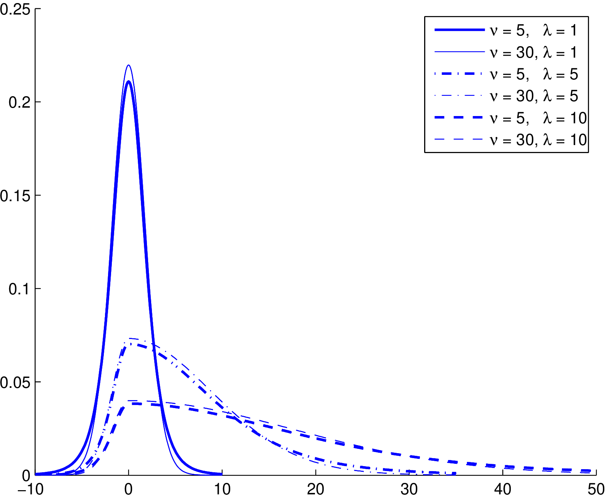

<!-- README.md is generated from README.Rmd. Please edit that file -->

# gratis 

<!-- badges: start -->

[](https://github.com/feng-li/dng/actions)
[](https://CRAN.R-project.org/package=dng)
<!-- badges: end -->

The R package `dng` (distributions and gradients)  provides efficient algorithms for density, distribution function, quantile function and random generation for the split normal and split-t distributions, and computes their mean, variance, skewness and kurtosis for the two distributions.


## Installation

### [CRAN version](https://CRAN.R-project.org/package=dng)

``` r
install.packages("dng")
```

### Development version

You can install the **development** version of `dng` package from
[GitHub Repository](https://github.com/feng-li/dng) with:

``` r
devtools::install_github("feng-li/dng")
```

## Usage

### Split normal distributions

``` r
library(dng)
n <- 3
mu <- c(0,1,2)
sigma <- c(1,2,3)
lmd <- c(1,2,3)
q0 <- rsplitn(n, mu, sigma, lmd)
d0 <- dsplitn(q0, mu, sigma, lmd, logarithm = FALSE)
p0 <- psplitn(q0, mu, sigma, lmd)
q1 <- qsplitn(p0,mu, sigma, lmd)
all.equal(q0, q1)
```

### Split-t distributions
``` r
n <- 3
mu <- c(0,1,2)
sigma <- c(1,2,3)
lmd <- c(1,2,3)
q0 <- rsplitn(n, mu, sigma, lmd)
d0 <- dsplitn(q0, mu, sigma, lmd, logarithm = FALSE)
p0 <- psplitn(q0, mu, sigma, lmd)
q1 <- qsplitn(p0,mu, sigma, lmd)
all.equal(q0, q1)
```

## References

-   Li, Feng, Villani, Mattias, & Kohn, Robert. (2010). "Flexible modeling of conditional distributions using smooth mixtures of asymmetric student t densities". _Journal of Statistical Planning & Inference_, 140(12), 3638-3654.

## License

This package is free and open source software, licensed under GPL-3.

## Acknowledgements

Feng Li is supported by the National Natural Science Foundation of China.
